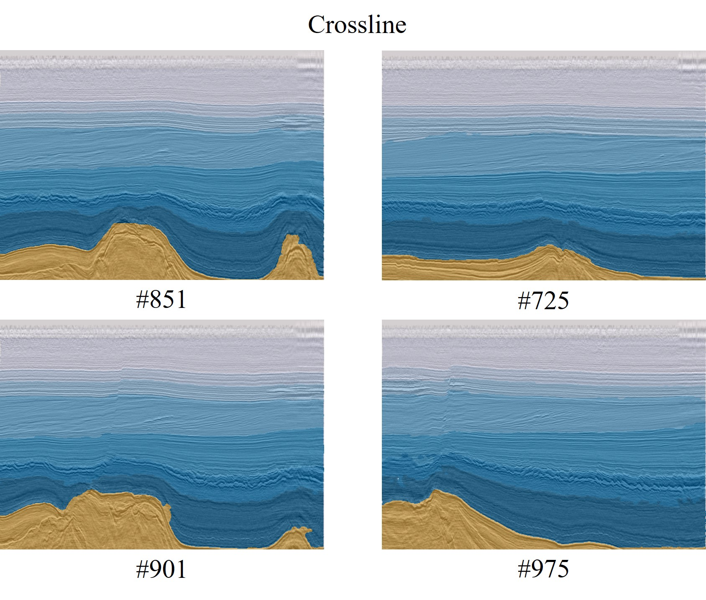

# U-Net-Stratum
基于简化的U-Net网络模型的荷兰F3地震层序识别


## 环境
- python 3.7
- pytorch 1.9.1
- CUDA 11.1

## 训练及验证

```commandline
python main.py --epochs [epoch_number] --train_data [train_data_path] --valid_data [val_data_path] --exp [experiment_name]
```
(仅给出部分参数，详细参数设置详见 main.py)

## 预测

```commandline
python main.py --prediction_only --prediction_data [pred_data_path] --exp [experiment_name]
```

## 结果展示




## 归属声明 / Attribution Statement :

如果您在您的项目中使用或参考了本项目（U-Net-Stratum）的代码，我们要求并感激您在项目文档或代码中包含以下归属声明：
```commandline
本项目使用了Ifjmww在GitHub上的U-Net-Stratum项目的代码，特此致谢。原项目链接：https://github.com/Ifjmww/U-Net-Stratum/
```
我们欣赏并鼓励开源社区成员之间的相互尊重和学习，感谢您的合作与支持。

&nbsp;

If you use or reference the code from this project (U-Net-Stratum) in your project, we require and appreciate an attribution statement in your project documentation or code as follows:
```commandline
Parts of this code are based on modifications of Ifjmww's U-Net-Stratum. Original project link: https://github.com/Ifjmww/U-Net-Stratum/
```
We value and encourage mutual respect and learning among members of the open source community. Thank you for your cooperation and support.


